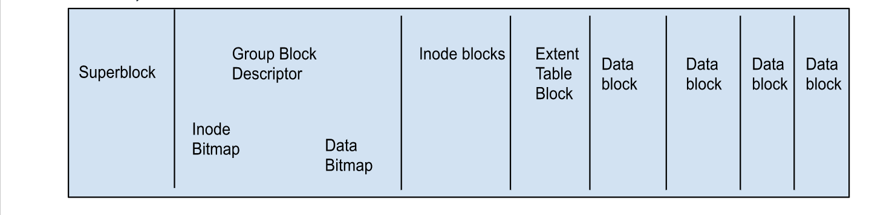

# Project Title

An extent based file system built on top of [libefuse](https://github.com/libfuse/libfuse) inspired by ext2 file system

## Table of Contents
- [Introduction](#introduction)
- [Features](#features)
- [Usage](#usage)

## Introduction
This project is a school assignment aimed at developing a robust and efficient extent based file system implementation. We create our disk for our file system using the following layout of superblock, Group Block Descriptor, Inode blocks and Extent Table Blocks.


Key features of the Extent-based File System project include:

- Extent Management: The file system efficiently manages file extents, allocating and deallocating space as needed, ensuring optimal storage utilization.

- Fragmentation Reduction: By utilizing extents, the file system minimizes file fragmentation, resulting in faster read and write operations.

- Scalability: The Extent-based File System is designed to handle large file sizes and a high number of files, making it suitable for various applications and use cases. This has been tested by downloading a 2GB video

- Data Integrity: The file system incorporates robust mechanisms to ensure data integrity, including checksums and error detection algorithms.

## Features
- Formatting a file image based on the number of inodes
- Normal file system operations [`cat`, `touch`, `ls`, `mkdir`, `rmdir`, `rm`, `wget`]

## Usage
```console
~ make
~ /mkfs.a1fs -f -i 128 test_image // This creates a disk image with 128 inodes
~ ./a1fs a1fs_test_image /tmp // Perform all operations in this path
~ mkdir /tmp/dirA
~ rmdir /tmp/dirA
~ ls
```
